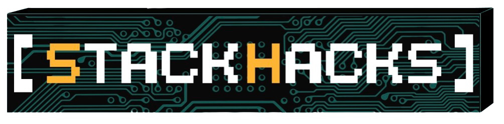

# Welcome to StackHacks! 🚀

👨‍💻 We are an enthusiastic Computer Science club at Binghamton University, committed to expanding our coding horizons, tackling practical challenges, and supporting the advancement of black, indigenous, and latinx computer science students in getting degreed and hired.

🎯 Our mission encompasses both the pursuit of technological expertise and the empowerment of underrepresented communities in tech, ensuring diversity and inclusion in our field.

🤝 Collaborating with Binghamton University's Information Technology Services, we provide our software engineers with real-world project experience, aiding in the progression of ITS initiatives while equipping our members with valuable skills for the tech industry.

🌐 Engaged in web development and machine learning, our projects foster innovation and professional growth for our club members.

🎓 We're proud that our soon to be graduates leave not only with meaningful contributions to the university but also with the competencies needed to thrive in the dynamic realm of computer science.

🔍 Stay tuned to our repositories as we continue to code, create, and collaborate!

📫 How to reach us: [stackhacks@binghamton.edu](mailto:stackhacks@binghamton.edu)
